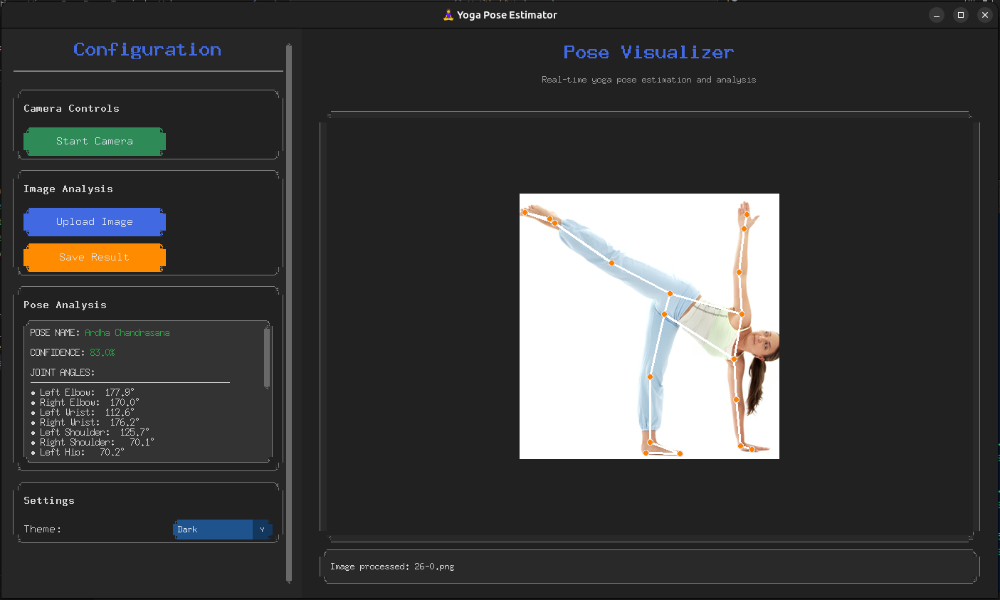

# 🧘‍♀️ Yoga Pose Estimator

[](https://python.org)
[](https://opencv.org)
[](https://mediapipe.dev)
[](https://github.com/TomSchimansky/CustomTkinter)

A sophisticated desktop application that uses computer vision to provide real-time analysis and classification of yoga poses. Built with **OpenCV** for image processing, **MediaPipe** for high-fidelity pose detection, and **CustomTkinter** for a modern user interface.

The application can analyze poses from both a live webcam feed and static images, offering instant feedback to help users improve their form and alignment.

***

## ✨ Features

* **Real-time Webcam Analysis:** Get instant pose classification and joint angle feedback from your camera.
* **Static Image Processing:** Upload an image to receive a detailed breakdown of the detected yoga pose.
* **Advanced Pose Classification:** Identifies over 30 distinct yoga poses using a weighted similarity scoring system for enhanced accuracy.
* **Corrective Feedback:** Provides actionable tips (e.g., "Straighten your Left Knee") by comparing your joint angles to ideal reference poses.
* **Modern & Intuitive GUI:** A sleek and user-friendly interface built with CustomTkinter.
* **Save & Export:** Save the processed image with pose landmarks and analysis for future reference.

***

## 📸 Demo



***

## 🛠️ Technologies Used

This project is built with a stack of modern computer vision and GUI libraries:

* **OpenCV:** For all image and video processing tasks.
* **MediaPipe:** For robust, high-performance human pose landmark detection.
* **CustomTkinter:** For creating the modern graphical user interface.
  
***

## 🚀 Setup and Installation

To run this project locally, follow these steps:

**1. Clone the Repository**
```
git clone https://github.com/trongkhanh083/yoga-pose-estimator.git
cd yoga-pose-estimator
```

**2. Create a Virtual Environment**
```
# For Windows
python -m venv venv
venv\Scripts\activate

# For macOS / Linux
python3 -m venv venv
source venv/bin/activate
```

**3. Install Dependencies**
```
pip install -r requirements.txt
```

**4. Run the Application**
```
python yoga_pose_gui.py
```

## 📖 How to Use

* **Live Camera Feed:** Click the "Start Camera" button. A separate window will open showing your camera feed with real-time pose landmarks. The analysis will appear in the "Pose Analysis" section on the left.
* **Analyze an Image:** Click the "Upload Image" button and select an image file (.jpg, .png, etc.). The processed image will appear in the main visualizer, and the analysis will be displayed on the left.
* **Save the Result:** After processing an uploaded image, click the "Save Result" button to save a copy of the annotated image.

## 📦 Building the Executable

This project uses PyInstaller to create a single, standalone executable. The build.spec file is already configured.
```
pyinstaller build.spec
```
The final executable will be located in the dist folder.

## 📄 License

This project is distributed under the MIT License.